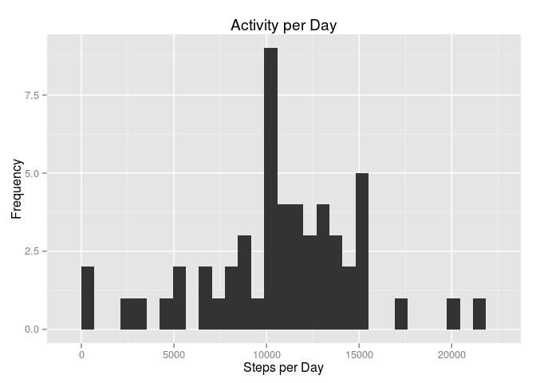
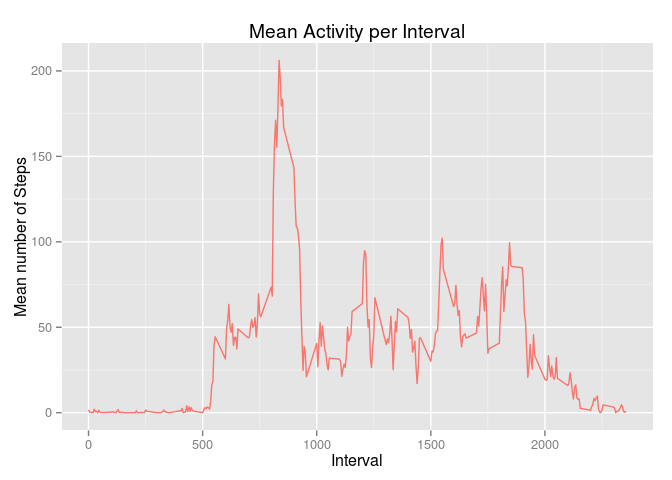
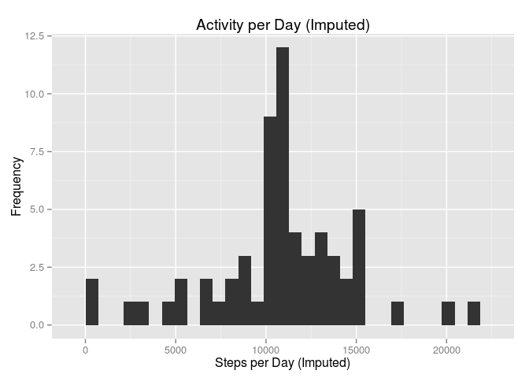
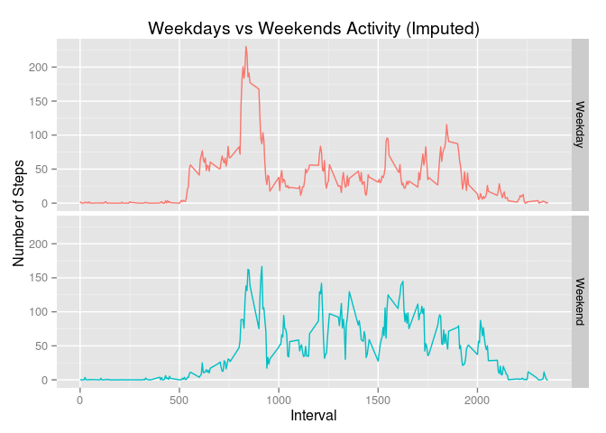

# Reproducible Research: Peer Assessment 1

Start by initializing a few R libraries. Turn echo on for R code chunks, center figures and suppress messages.

```r
library(ggplot2)
library(knitr)
library(xtable)
opts_chunk$set(echo=TRUE, fig.align='center', message=FALSE)
```

### Loading and preprocessing the data
**Q)** Load the data (i.e. `read.csv()`).  
**A)** Unzip the activity.zip file and read the activity.csv file into the data frame `activity`. The activity.csv file will be overwritten if it already exists.

```r
unzip("activity.zip")
activity <- read.csv("activity.csv")
```
<br>
**Q)** Process/transform the data (if necessary) into a format suitable for your analysis.  
**A)** Convert the `steps` and `interval` columns of the `activity` data frame to numerics. Create `activityCC` data frame containing only the complete cases from `activity`.

```r
activity$steps <- as.numeric(as.character(activity$steps))
activity$interval <- as.numeric(as.character(activity$interval))
activityCC <- activity[complete.cases(activity), ]
```

### What is the mean total number of steps taken per day?
**Q)** Make a histogram of the total number of steps taken each day.  
**A)** Create a new array `stepsPerDayTotal` from `activityCC` taking the sum of the steps per day. Plot the daily activity histogram using `stepsPerDayTotal`.

```r
stepsPerDayTotal <- tapply(activityCC$steps, factor(activityCC$date), sum, na.rm=T)
qplot(
  stepsPerDayTotal, 
  main='Activity per Day', 
  xlab="Steps per Day", 
  ylab="Frequency", 
  type="l")
```


<br>
**Q)** Calculate and report the mean and median total number of steps taken per day.  
**A)** Create data frame `stepsPerDaySummary` by calculating the mean and median of steps per day. Print data frame `stepsPerDaySummary` using `xtable()`.

```r
stepsPerDaySummary <- data.frame(mean(stepsPerDayTotal), median(stepsPerDayTotal))
names(stepsPerDaySummary) <- c('Mean Steps per Day', 'Median Steps per Day')
rownames(stepsPerDaySummary)[1] <- 'Steps with NA values removed'
print(xtable(stepsPerDaySummary), type='HTML', html.table.attributes="align='center', border='2px', width='600px'")
```

<!-- html table generated in R 3.0.2 by xtable 1.7-3 package -->
<!-- Mon Aug 18 08:37:13 2014 -->
<TABLE align='center', border='2px', width='600px'>
<TR> <TH>  </TH> <TH> Mean Steps per Day </TH> <TH> Median Steps per Day </TH>  </TR>
  <TR> <TD align="right"> Steps with NA values removed </TD> <TD align="right"> 10766.19 </TD> <TD align="right"> 10765.00 </TD> </TR>
   </TABLE>
<br>

### What is the mean daily activity pattern?
**Q)** Make a time series plot (i.e. type = "l") of the 5-minute interval (x-axis) and the average number of steps taken, averaged across all days (y-axis).  
**A)** Create a new data frame `stepsPerIntervalMean` by mapping date and mean(steps) from `activityCC`. Plot the `stepsPerIntervalMean` data frame in time series.

```r
stepsPerIntervalMean <- aggregate(steps ~ interval, activityCC, mean, na.action=na.omit)
names(stepsPerIntervalMean)[2] <- 'steps_mean'
ggplot(stepsPerIntervalMean, aes(x=(interval), y=(steps_mean), colour=TRUE), guide=FALSE) +
  geom_line() + 
  guides(fill=F, colour=FALSE) +
  ggtitle('Mean Activity per Interval') +
  ylab('Mean number of Steps') + 
  xlab('Interval')
```


<br>
**Q)** Which 5-minute interval, on average across all the days in the dataset, contains the maximum number of steps?  
**A)** Find the peak activity interval over the mean steps per interval data frame `stepsPerIntervalMean`.

```r
peakInterval <- stepsPerIntervalMean[which.max(stepsPerIntervalMean[, 2]), ]$interval
```
The peak activity interval returned in the `peakInterval` variable is **835**.
 
### Imputing missing values
**Q)** Calculate and report the total number of missing values in the dataset (i.e. the total number of rows with `NA`s).  
**A)** We have some missing values in the `activity` data frame, let's figure out how many.

```r
countNA <- nrow(activity) - nrow(activityCC)
```
Per the `countNA` variable we have **2304** missing values in the `activity` data frame.  
<br>
**Q)** Devise a strategy for filling in all of the missing values in the dataset. The strategy does not need to be sophisticated. For example, you could use the mean/median for that day, or the mean for that 5-minute interval, etc.  
**A)** Let's adopt a strategy of defaulting the missing items to the mean per interval recorded in the `stepsPerIntervalMean` data frame. Appended the `steps_imputed` column to the `activity` data frame.

```r
activity <- merge(activity, stepsPerIntervalMean)
activity <- cbind(
  activity, 
  steps_imputed=ifelse(
    is.na(activity$steps), 
    activity$steps_mean,
    activity$steps))
```
<br>
**Q)** Create a new dataset that is equal to the original dataset but with the missing data filled in.  
**A)** Create `activityImpute` data frame with only the imputed values from the `activity` data frame.

```r
activityImpute <- activity[, c(1, 3, 5)]
names(activityImpute)[3] <- 'steps'
```
<br>
**Q)** Make a histogram of the total number of steps taken each day.  
**A)** Create a new array `stepsPerDayTotalImputed` from `activityImpute` taking the sum of the steps per day. Plot the daily activity histogram using `stepsPerDayTotalImputed` as input.

```r
stepsPerDayTotalImputed <- tapply(activityImpute$steps, factor(activityImpute$date), sum, na.rm=T)
qplot(
  stepsPerDayTotalImputed, 
  main='Activity per Day (Imputed)', 
  xlab="Steps per Day (Imputed)", 
  ylab="Frequency", 
  type="l")
```


<br>
**Q)** Calculate and report the mean and median total number of steps taken per day.  
**A)** Calculate the mean and median over the array `stepsPerDayTotalImputed` and row bind them to `stepsPerDaySummary`. Print the resulting `stepsPerDaySummary` state using `xtable()`.

```r
stepsPerDaySummary <- rbind(
  stepsPerDaySummary, 
  c(mean(stepsPerDayTotalImputed), median(stepsPerDayTotalImputed)))
rownames(stepsPerDaySummary)[2] <- 'Steps with NA values imputed'
print(xtable(stepsPerDaySummary), type='HTML', html.table.attributes="align='center', border='2px', width='600px'")
```

<!-- html table generated in R 3.0.2 by xtable 1.7-3 package -->
<!-- Mon Aug 18 08:37:14 2014 -->
<TABLE align='center', border='2px', width='600px'>
<TR> <TH>  </TH> <TH> Mean Steps per Day </TH> <TH> Median Steps per Day </TH>  </TR>
  <TR> <TD align="right"> Steps with NA values removed </TD> <TD align="right"> 10766.19 </TD> <TD align="right"> 10765.00 </TD> </TR>
  <TR> <TD align="right"> Steps with NA values imputed </TD> <TD align="right"> 10766.19 </TD> <TD align="right"> 10766.19 </TD> </TR>
   </TABLE>
<br>
<br>
**Q)** Do these values differ from the estimates from the first part of the assignment? What is the impact of imputing missing data on the estimates of the total daily number of steps?  
**A)** Using the mean per interval as default value for NA values we retain the same mean value. The medain value however becomes equal to the mean value because we have multiple days without any measurements and the difference between our initial mean and median was very small (1.19).

### Are there differences in activity patterns between weekdays and weekends?
**Q)** Create a new factor variable in the dataset with two levels – “weekday” and “weekend” indicating whether a given date is a weekday or weekend day.  
**A)** Append column `weekday` to data frame `activityImpute`. Use the `weekday` column to determine and then append `daytype` column to data frame `activityImpute`. Calculate the mean steps per interval over the newly imputed values and store them in data frame `stepsPerIntervalMeanImpute`.

```r
activityImpute <- cbind(activityImpute, weekday=weekdays(as.Date(activityImpute$date)))
activityImpute <- cbind(
  activityImpute, 
  daytype= ifelse(
    activityImpute$weekday == 'Saturday' | activityImpute$weekday == 'Sunday',
    'Weekend', 
    'Weekday'))

stepsPerIntervalMeanImpute <- aggregate(
  steps ~ interval + daytype, 
  activityImpute, 
  mean, 
  na.action=na.omit)
```
<br>
**Q)** Make a panel plot containing a time series plot (i.e. type = "l") of the 5-minute interval (x-axis) and the average number of steps taken, averaged across all weekday days or weekend days (y-axis).  
**A)** Plot the comparison between weekdays and weekends using the `stepsPerIntervalMeanImpute` data frame as input.

```r
ggplot(stepsPerIntervalMeanImpute, aes(x=(interval), y=(steps), colour=daytype), guide=FALSE) +
  geom_line() + 
  facet_grid(daytype ~ .)  + 
  guides(fill=F, colour=FALSE) +
  ggtitle('Weekdays vs Weekends Activity (Imputed)') +
  ylab('Number of Steps') + 
  xlab('Interval')  
```


